## NYC Yellow Taxi Trip Fare and Location Analysis Using Big Data

**Abstract**

Big data is not a new concept. However, with the immense evolution in the metropolitan areas and technology almost  90 percent of the available data was created in the last few years. The importance of big data  doesn’t reside on how much data we collected but how we utilize the collected data in a way that will help analyze, solve problems and create new growth opportunities. This Project highlights the  prevailing use of urban big data in   analyzing the yellow  taxicab daily earning average per hour  using the most updated dataset given by TLC of NYC, by applying MapReduce model, spark, Hive and BigQuery to come up with the best result. Based on our result we are planning to find solution on how to bring up the yellow taxi earning average to its highest level.  With this solution we will help Yellow taxi  companies services as well as drivers, and more important we will preserve  one of the NYC symbolic elements from been invaded.

**Problem:**

NYC Yellow Taxicab business has been decreasing lately, and many taxi drivers has  switched to other companies. Some of the factors are:

   - Yellow Taxicab earning average is decreasing 
   - Competition of Companies like UBER
   - Lack of real time  analysis to yellow taxi trips
   - The wrong choice and estimation of the best time and location

**System setup**

- Amazon simple storage S3 and EC2 for loading our dataset from the website to s3.
- Amazon Elastic MapReduce (EMR) with Hadoop and its ecosystem already installed and configured … still we need to link it to S3 and - choose number of instances.
- BigQuery service in google cloud we will need it to query on it for the active areas problem. 

**EMR in AWS implementing MapReduce** 

- Create a simple Java Project in eclipse that has the Map, Reduce and the driver class.
- Export the project in a Jar, upload it to S3.
- Run the job on EMR using S3 dataset, application and output locations.
- In case job cannot go from running to completed status we check logs file to errors. 

**Target Data**

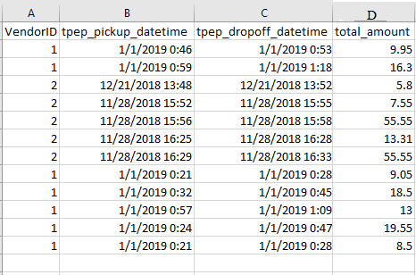

**Uploading Data**

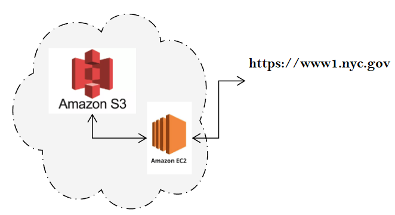

**Map function**

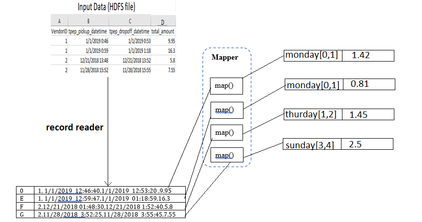

**Reduce function and Output**

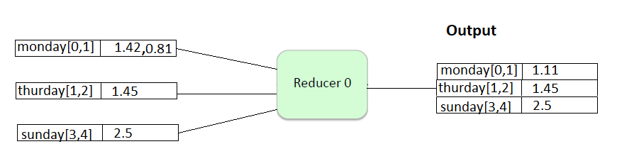

**Mapreduce Result**

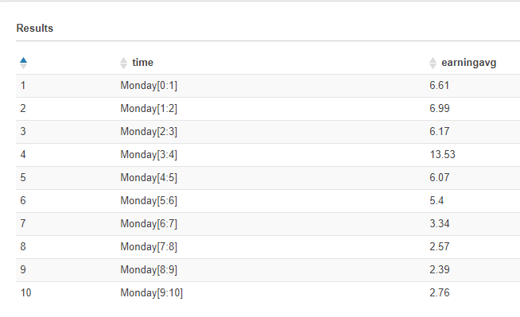

**BigQuery**

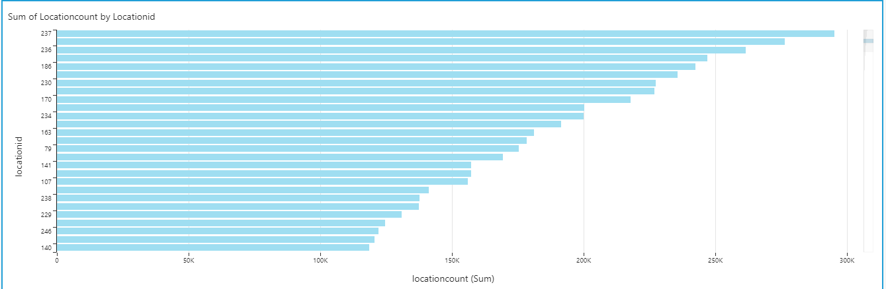

**Bigquery result on Athena**

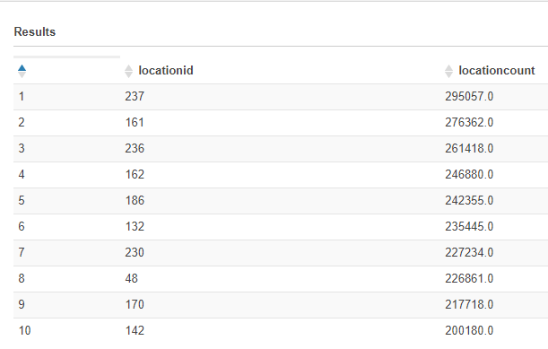

**Hive**

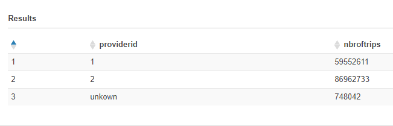

**Spark**

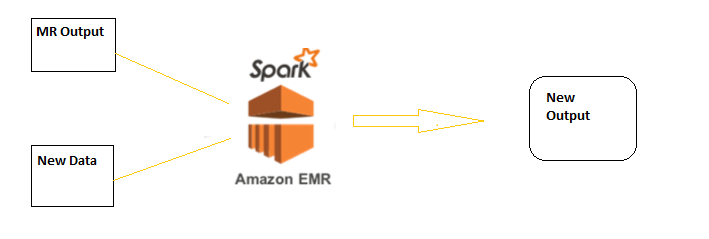

**Spark table in Athena** 

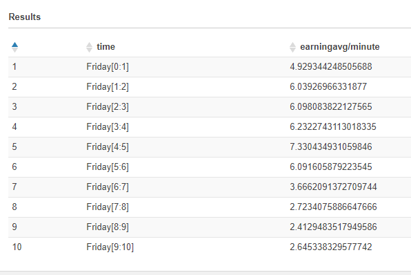

**AWS steps**

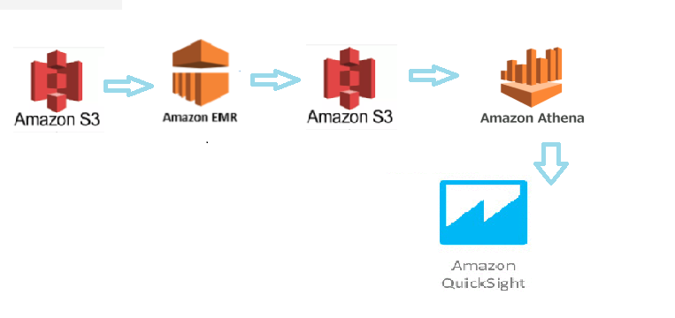

**Evaluation**

In this project we are evaluating the performance of both spark and MapReduce in solving problem I of hourly earning average per trip and problem 3 of  real time analysis of trip average fares per hour . We assume the following result

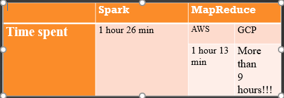

**Visualization Mapreduce**

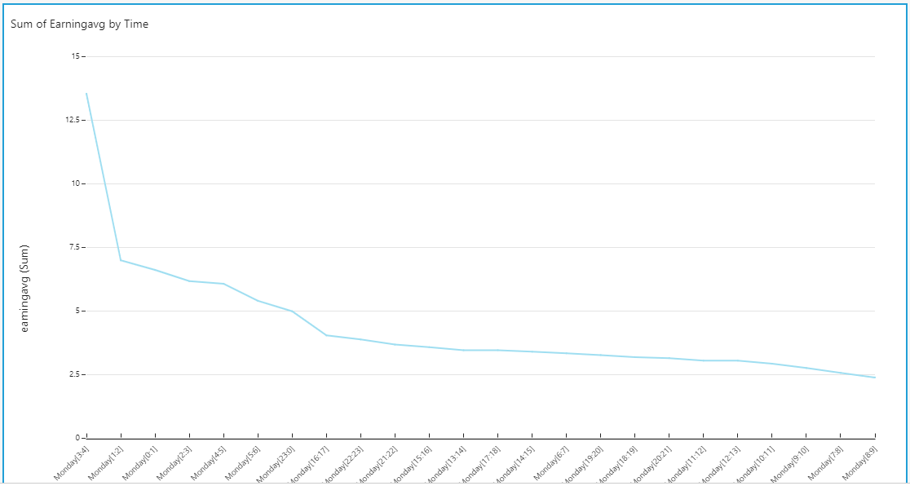

**Visualization  spark ouput**

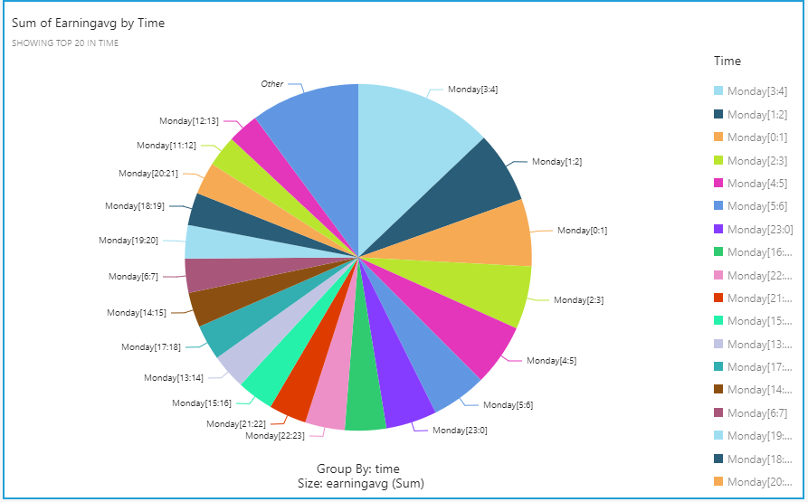

**Visualization  of Hive **

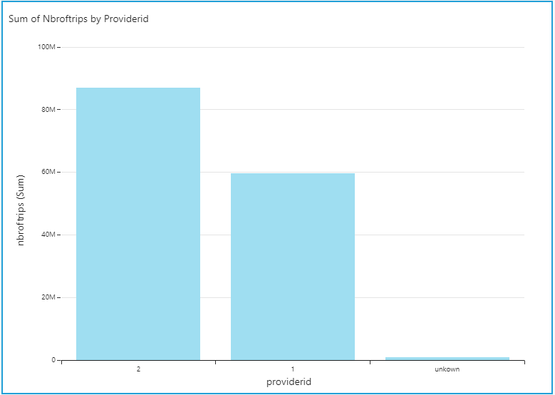

**Visualization  of Bigquery**

**Future work**

Kibana is an open source data visualization plugin for Elasticsearch. 

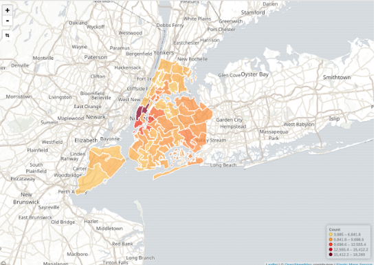

